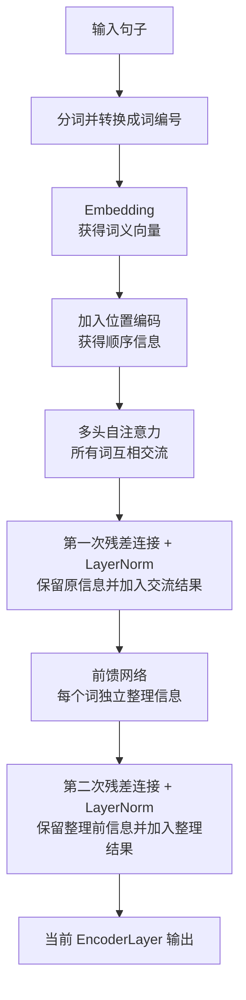
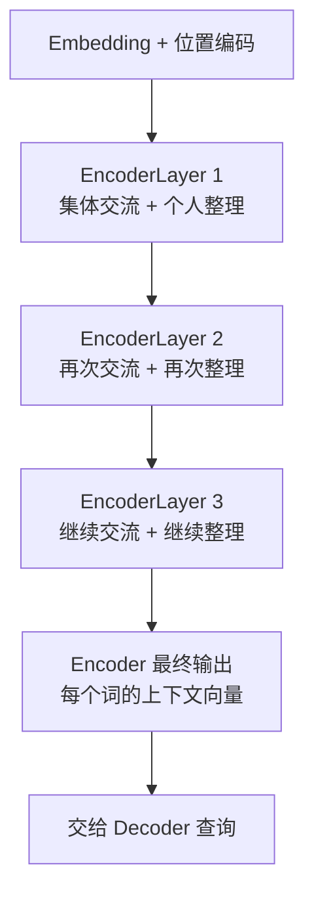

# 从 CNN、RNN 的局限到 Transformer 实现

在学习 Transformer 之前，可以先理解 CNN 和 RNN 各自是怎样观察数据的。

## 目录

- [1. CNN：擅长观察局部特征](#1-cnn擅长观察局部特征)
  - [1.1 一个完整的 CNN 卷积示例](#11-一个完整的-cnn-卷积示例)
  - [1.2 Padding 如何影响输出尺寸](#12-padding-如何影响输出尺寸)
  - [1.3 感受野为什么从 1×1 变成 3×3，再变成 5×5](#13-感受野为什么从-11-变成-33再变成-55)
  - [1.4 用完整过程理解 3×3 到 5×5 的感受野](#14-用完整过程理解-33-到-55-的感受野)
  - [1.5 CNN 为什么难以处理长距离关系](#15-cnn-为什么难以处理长距离关系)
- [2. RNN：按照顺序逐个阅读](#2-rnn按照顺序逐个阅读)
  - [2.1 RNN 怎样按顺序传递信息](#21-rnn-怎样按顺序传递信息)
  - [2.2 RNN 为什么难以记住远处的信息](#22-rnn-为什么难以记住远处的信息)
- [3. 两者的局限有什么不同？](#3-两者的局限有什么不同)
- [4. Transformer 编码器：让每个词结合整句话重新理解自己](#4-transformer-编码器让每个词结合整句话重新理解自己)
  - [4.1 编码器的完整流程](#41-编码器的完整流程)
  - [4.2 Embedding 与位置编码](#42-embedding-与位置编码)
  - [4.3 每个词生成自己的 Query、Key、Value](#43-每个词生成自己的-querykeyvalue)
  - [4.4 注意力权重与 Value 汇总](#44-注意力权重与-value-汇总)
  - [4.5 多头注意力](#45-多头注意力)
  - [4.6 第一次残差连接与 LayerNorm](#46-第一次残差连接与-layernorm)
  - [4.7 前馈网络与第二次残差连接](#47-前馈网络与第二次残差连接)
  - [4.8 多个 EncoderLayer 的堆叠](#48-多个-encoderlayer-的堆叠)
  - [4.9 与当前代码的对应关系](#49-与当前代码的对应关系)
- [5. Transformer 解码器：查询原文并逐步生成结果](#5-transformer-解码器查询原文并逐步生成结果)
  - [5.1 先理解 Encoder 输出的形状](#51-先理解-encoder-输出的形状)
  - [5.2 BOS 与 EOS：从哪里开始，在哪里结束](#52-bos-与-eos从哪里开始在哪里结束)
  - [5.3 Decoder 怎样逐步生成内容](#53-decoder-怎样逐步生成内容)
  - [5.4 DecoderLayer 的三个处理阶段](#54-decoderlayer-的三个处理阶段)
    - [5.4.1 掩码自注意力怎样防止偷看答案](#541-掩码自注意力怎样防止偷看答案)
  - [5.5 Encoder 与 Decoder 怎样交互](#55-encoder-与-decoder-怎样交互)
  - [5.6 完整翻译过程](#56-完整翻译过程)
  - [5.7 Encoder-only、Decoder-only 和 Encoder-Decoder](#57-encoder-onlydecoder-only-和-encoder-decoder)
- [6. 最终总结](#6-最终总结)

## 1. CNN：擅长观察局部特征

CNN（卷积神经网络）可以想象成拿着一个很小的放大镜观察图片。

例如，一张图片中有一只猫：

```text
左上角：猫的耳朵
中间：  猫的眼睛
右下角：猫的尾巴
```

一个较小的卷积核每次只能看到图片中的一小块区域：

```text
┌───────────────整张图片───────────────┐
│  ┌──────┐                            │
│  │卷积核│  ← 当前只能观察这一小块      │
│  └──────┘                            │
│                              猫尾巴  │
└──────────────────────────────────────┘
```

因此，CNN 很擅长识别局部特征，例如边缘、纹理、眼睛和耳朵。随着卷积层不断叠加，它的观察范围会逐渐变大，也可以把耳朵、眼睛和尾巴组合成“猫”。

但是，如果两个特征距离很远，信息通常需要经过多层卷积才能联系起来。也就是说，CNN **不是完全不能理解远距离关系**，而是需要依靠更深的网络逐层传递信息。

可以把这个过程想象成传话：

```text
左上角的耳朵 → 中间区域 → 右侧区域 → 右下角的尾巴
```

距离越远，需要经过的中间步骤通常越多。

### 1.1 一个完整的 CNN 卷积示例

下面使用一个具体例子说明卷积层究竟进行了什么计算。假设：

```text
输入矩阵：5×5
卷积核：  3×3
步长：    1
Padding： 0
偏置：    0
```

输入矩阵为：

```text
1   2   3   4   5
6   7   8   9  10
11 12  13  14  15
16 17  18  19  20
21 22  23  24  25
```

卷积核为：

```text
1  0  1
0  1  0
1  0  1
```

卷积核里的 9 个数字是模型参数。它们在一次扫描过程中保持不变，并被重复用于输入矩阵的所有局部区域。

#### 第一步：滑动窗口取出 9 个区域

`3×3` 的卷积核以步长 1 从左向右、从上向下移动。它会观察下面 9 个区域：

```text
区域①          区域②          区域③

1  2  3         2  3  4         3  4  5
6  7  8         7  8  9         8  9 10
11 12 13        12 13 14        13 14 15
```

```text
区域④          区域⑤          区域⑥

6  7  8         7  8  9         8  9 10
11 12 13        12 13 14        13 14 15
16 17 18        17 18 19        18 19 20
```

```text
区域⑦          区域⑧          区域⑨

11 12 13        12 13 14        13 14 15
16 17 18        17 18 19        18 19 20
21 22 23        22 23 24        23 24 25
```

这 9 个 `3×3` 区域是计算时的观察窗口，并不是最终得到的 9 个输出矩阵。

#### 第二步：每个区域计算出一个数字

每个区域都和同一个卷积核对应位置相乘，再把结果相加并加上偏置。这可以看成 `y = ax + b` 在多个输入上的扩展：

```text
y = w₁x₁ + w₂x₂ + ... + w₉x₉ + b
```

例如，区域①与卷积核计算：

```text
输入区域①       卷积核

1   2   3        1  0  1
6   7   8   ×    0  1  0
11 12  13        1  0  1
```

```text
X₁₁ = 1×1 + 2×0 + 3×1
     + 6×0 + 7×1 + 8×0
     + 11×1 + 12×0 + 13×1
     = 35
```

区域②得到：

```text
X₁₂ = 2 + 4 + 8 + 12 + 14 = 40
```

以同样方式计算全部 9 个区域：

```text
区域① → 35    区域② → 40    区域③ → 45
区域④ → 60    区域⑤ → 65    区域⑥ → 70
区域⑦ → 85    区域⑧ → 90    区域⑨ → 95
```

#### 第三步：9 个结果组成一张特征图

把 9 个数字按照窗口原来的位置排列，得到：

```text
35  40  45
60  65  70
85  90  95
```

这张 `3×3` 矩阵叫作第一层的**输出特征图**，它也是第二层的输入。

需要区分：

```text
卷积核中的数字：模型参数，表示这一层要寻找什么特征
卷积产生的数字：中间特征，表示对应区域出现了多少这种特征
```

#### 第四步：第二层继续提取特征

第二层不是停止提取，而是把第一层的特征图当成新输入，再使用第二层自己的卷积核重复相同操作：

```text
原始数据 + 第一层卷积核参数
                ↓
         第一层特征图
                ↓
第一层特征 + 第二层卷积核参数
                ↓
         第二层特征图
```

##### 情况一：不使用 Padding，特征图尺寸继续缩小

如果第二层仍使用 `3×3` 卷积核、步长 1 且 `padding=0`，那么 `3×3` 的输入只能被完整覆盖一次，输出大小为 `1×1`。

假设第二层仍使用：

```text
1  0  1
0  1  0
1  0  1
```

那么第二层计算为：

```text
35×1 + 40×0 + 45×1
+ 60×0 + 65×1 + 70×0
+ 85×1 + 90×0 + 95×1
= 325
```

因此：

```text
5×5 原始输入
    ↓ 第一次 3×3 卷积
3×3 第一层特征图
    ↓ 第二次 3×3 卷积
1×1 第二层特征图：325
```

每层卷积后通常还会经过 ReLU 等激活函数。卷积负责线性计算，激活函数引入非线性，使多层网络能够表达复杂规律。

### 1.2 Padding 如何影响输出尺寸

#### 情况一：不使用 Padding，输出尺寸会变小

如果不允许卷积核超出输入边界，输出尺寸为：

```text
输出宽度 = 输入宽度 - 卷积核宽度 + 1
```

所以：

```text
5×5 输入 → 3×3 卷积 → 3×3 输出
3×3 输入 → 3×3 卷积 → 1×1 输出
```

#### 情况二：使用 Padding，输出尺寸可以保持不变

如果希望 `3×3` 输入经过卷积后仍得到 `3×3` 输出，可以使用 `padding=1`，先在四周补一圈 0：

```text
0   0   0   0   0
0  35  40  45   0
0  60  65  70   0
0  85  90  95   0
0   0   0   0   0
```

此时 `3×3` 卷积核可以扫描 9 次。使用前面的卷积核，第二层输出为：

```text
100 170 110
190 325 200
150 220 160
```

因此：

```text
padding=0：空间尺寸逐层缩小
padding=1：3×3 卷积、步长 1 时，空间尺寸可以保持不变
```

Padding 影响的是输出特征图的尺寸，不会阻止感受野逐层扩大。

### 1.3 感受野为什么从 1×1 变成 3×3，再变成 5×5

**感受野**表示某一层的一个输出位置，最多依赖原始输入中的多大范围。为避免层数名称混乱，这里把原始输入称为第 0 层：

```text
第0层：原始输入位置       → 感受野 1×1
第1层：第一次 3×3 卷积   → 感受野 3×3
第2层：第二次 3×3 卷积   → 感受野 5×5
第3层：第三次 3×3 卷积   → 感受野 7×7
```

原始输入中的一个数字只代表自己。例如原图中心的 `13` 在卷积之前只包含 `13` 自身的信息，所以起点是 `1×1`。

```text
卷积之前，中心位置只看自己：

1   2   3   4   5
6   7   8   9  10
11 12 [13] 14  15
16 17  18  19  20
21 22  23  24  25

[13] 的感受野 = 1×1
```

第一次卷积的左上角输出 `35` 由下面 9 个数字计算得到：

```text
1   2   3        1  0  1
6   7   8   ×    0  1  0
11 12  13        1  0  1

35 = 1 + 3 + 7 + 11 + 13
```

因此，`35` 虽然只是一个数字，但它依赖原图中的 `3×3` 区域，它的感受野是 `3×3`。第一层其余输出也分别依赖一个 `3×3` 区域：

```text
35 来自：        40 来自：        45 来自：

1  2  3          2  3  4          3  4  5
6  7  8          7  8  9          8  9 10
11 12 13         12 13 14         13 14 15
```

只看这三个区域的横向范围：

```text
35 的范围：1 2 3
40 的范围：  2 3 4
45 的范围：    3 4 5
```

它们的并集是原图第 1～5 列：

```text
1 2 3 4 5
```

相邻窗口的步长为 1，因此大量区域重叠。覆盖范围不是 `3+3+3=9`，而是：

```text
第一个窗口贡献 3 格
第二个窗口只新增 1 格
第三个窗口只新增 1 格

3 + 1 + 1 = 5
```

纵向也相同。第一层三行输出的观察区域分别从原图第 1、2、3 行开始，合并后覆盖原图第 1～5 行。

第二层使用同一个示例卷积核处理第一层特征图：

```text
第一层特征图      第二层卷积核

35 40 45          1  0  1
60 65 70     ×    0  1  0
85 90 95          1  0  1
```

计算得到：

```text
第二层输出
= 35×1 + 40×0 + 45×1
+ 60×0 + 65×1 + 70×0
+ 85×1 + 90×0 + 95×1
= 325
```

`325` 直接依赖第一层的 `35、45、65、85、95`。这些数字又分别依赖原图的左上、右上、中心、左下和右下区域。把它们在原图上的范围合并后，覆盖的是完整 `5×5`：

```text
1   2   3   4   5
6   7   8   9  10
11 12  13  14  15
16 17  18  19  20
21 22  23  24  25
```

因此，第二层的 `325` 虽然也只是一个数字，但它间接依赖原始输入的整个 `5×5` 范围，所以它的感受野是 `5×5`。

当卷积核为 `3×3`、步长为 1 时，每增加一层，感受野会向上下左右各扩展 1 格，因此宽和高各增加 2：

```text
1×1 → 3×3 → 5×5 → 7×7 → 9×9
```

在这种条件下，感受野大小可以写成：

```text
新感受野 = 旧感受野 + (卷积核大小 - 1)
```

最容易混淆的是输出尺寸和感受野尺寸：

```text
输出尺寸：这一层一共有多少个输出位置
感受野：  其中一个输出位置依赖原图多大的区域
```

不使用 Padding 时，两者的变化方向可能刚好相反：

```text
特征图尺寸：5×5 → 3×3 → 1×1
感受野尺寸：1×1 → 3×3 → 5×5
```

一句话总结：

> 每层卷积仍然只观察上一层的一小块，但上一层的每个位置已经总结了更早一层的局部信息；相邻区域通过多层卷积逐渐汇合，所以越深层的位置能够间接看到越大的原图范围。

### 1.4 用完整过程理解 3×3 到 5×5 的感受野

可以把前面的过程连起来理解。

原图一共有 25 个数字。第一次使用 `3×3` 卷积核、步长为 1 进行卷积时，第一层左上角的输出 `35` 来自原图中的：

```text
1   2   3
6   7   8
11 12  13
```

所以，`35` 在原图上的感受野是 `3×3`。按照相同的方法滑动卷积核，可以得到完整的第一层特征图：

```text
35 40 45
60 65 70
85 90 95
```

第二层计算 `325` 时，卷积窗口会覆盖这 9 个第一层特征。这里的关键是：这 9 个数字并不是彼此独立的原始数字，每个数字背后都已经对应原图中的一个 `3×3` 区域。例如：

```text
35 对应的原图区域：    45 对应的原图区域：

1   2   3              3   4   5
6   7   8              8   9  10
11 12  13              13 14  15
```

这些 `3×3` 区域之间存在重叠。横向看，最左侧区域覆盖原图第 1～3 列，最右侧区域覆盖第 3～5 列，它们合并后真正覆盖的是第 1～5 列，而不是 9 列：

```text
1 2 3
    3 4 5
合并后：1 2 3 4 5
```

纵向也是同样的道理：最上方区域从第 1 行开始，最下方区域延伸到第 5 行，合并后覆盖第 1～5 行。因此，第二层输出 `325` 最终能够感知原图中的完整 `5×5` 区域。

需要注意，第二层的卷积窗口覆盖了第一层的 9 个位置；在当前示例卷积核中，只有权重为 1 的 5 个位置实际参与 `325` 的加法。不过，这些位置背后的原图区域合并后同样覆盖完整的 `5×5`，所以结论不变：

```text
第一层的一个输出：感受野为 3×3
第二层的一个输出：感受野为 5×5
```

也就是说，第二层并不是直接在原图上使用了一个 `5×5` 卷积核，而是通过叠加两层 `3×3` 卷积，间接观察到了原图中的 `5×5` 范围。

### 1.5 CNN 为什么难以处理长距离关系

理解了感受野，就能进一步回答：为什么 CNN 处理长距离关系比较困难？

根本原因是：**一次卷积只能直接连接相邻区域，距离较远的两个位置必须经过多层卷积，信息才能汇合。**

仍以 `3×3` 卷积核、步长 1 为例。一个输出位置的感受野会这样增长：

```text
原始输入：1×1
第 1 层：3×3
第 2 层：5×5
第 3 层：7×7
第 4 层：9×9
```

假设图片左上角有一只猫的耳朵，右下角有一条猫的尾巴。浅层卷积只能分别识别它们：

```text
左上角局部区域 → 识别出耳朵
右下角局部区域 → 识别出尾巴
```

只有当网络足够深、某一层的感受野能够同时覆盖这两个区域时，模型才有机会把“耳朵”和“尾巴”联系起来，进一步判断它们属于同一只猫。它们之间的信息路径大致是：

```text
耳朵 → 邻近区域 → 更大的区域 → …… → 尾巴
```

距离越远，需要经过的卷积层通常越多。这会带来几个问题：

1. **关系建立得较晚。** 浅层只能提取局部特征，远处特征要到较深层才能相遇。
2. **信息要经过多次加工。** 每经过一层，特征都会被重新组合；传递路径越长，保留精确关系就越困难。
3. **需要更深的网络。** 更深的网络会增加计算量，也会提高训练难度。

### 1.6 为什么多层传递可能弱化信息？

这里所说的“信息损失”不是小数计算不够精确，而是原始特征经过多次提取和压缩后，一些细节可能没有继续保留下来。

卷积层不会把看到的所有原始像素原封不动地传到下一层，而是根据卷积核，将一块区域重新组合成新的特征。例如，第一层可能保留“这里有一条斜边”，下一层再把多条边组合成“这里像一只耳朵”。这个过程会突出对当前任务有用的模式，同时也可能弱化颜色、准确位置或细小纹理等信息。

```text
原始像素
  ↓ 卷积：提取边缘等局部特征
边缘特征
  ↓ 卷积：组合成纹理或形状
局部形状
  ↓ 更多卷积：组合成物体部件
高级特征
```

在这个过程中，以下操作都可能减少细节：

1. **卷积重新组合信息。** 下一层接收到的是上一层提取后的特征，而不是最初的原始像素。
2. **激活函数进行筛选。** 例如 ReLU 会把小于 0 的结果变成 0，一部分响应不会继续传递。
3. **池化或带步长的卷积降低尺寸。** 多个相邻位置会被合并，虽然保留了主要特征，但精确位置和局部细节可能减少。

假设耳朵和尾巴距离很远，它们的信息要各自经过多层加工，直到某一层的感受野能够同时覆盖两者，模型才能建立联系。此时高层可能仍然知道“这里有耳朵”和“那里有尾巴”，但浅层中的准确边缘、位置和纹理已经被多次概括。因此，传递路径越长，模型越难同时保留两端的精细信息并准确学习它们之间的关系。

不过，这并不表示 CNN 每经过一层就一定会丢失重要信息。卷积核是通过训练学习的，模型会尽量保留对任务有用的特征；残差连接等结构也能帮助信息跨层传递。更准确的说法是：**远距离特征需要经过更多次变换和压缩，因此精确信息被弱化的风险更高，关系也更难学习。**

池化、带步长的卷积、空洞卷积等方法可以让感受野扩大得更快，因此能缓解这个问题。但对于普通的小卷积核 CNN，远距离位置之间仍然缺少直接连接。

所以，CNN 并不是不能处理长距离关系，而是远距离信息需要沿着网络逐层传递，不能一步建立联系。

## 2. RNN：按照顺序逐个阅读

### 2.1 RNN 怎样按顺序传递信息

RNN（循环神经网络）不像 CNN 那样同时观察一小块空间，它会按照顺序逐个读取文字。

例如：

```text
我 → 不 → 喜欢 → 吃 → 苹果
```

RNN 每读到一个词，都会把当前信息放进自己的“记忆”中，再带着这份记忆读取下一个词：

```text
读到“我”       记忆：句子和“我”有关
读到“不”       记忆：出现了否定
读到“喜欢”     记忆：我不喜欢……
读到“吃”       记忆：我不喜欢吃……
读到“苹果”     记忆：我不喜欢吃苹果
```

所以，RNN 天然知道文字的先后顺序。下面两句话进入 RNN 的顺序不同：

```text
我 → 吃 → 苹果
苹果 → 吃 → 我
```

因此，不能简单地说 RNN 无法区分“我吃苹果”和“苹果吃我”。理论上，RNN 可以利用读取顺序区分它们。

### 2.2 RNN 为什么难以记住远处的信息

RNN 真正困难的地方是**长距离记忆**。根本原因是：**较早的信息必须被反复放入隐藏状态，并经过后续每一个时间步，才能到达较远的位置。**

例如：

```text
那棵树，经过许多年风吹雨打，如今已经长得非常高大，昨天晚上突然倒了。
```

当 RNN 读到最后的“倒了”时，需要记住很早以前出现的中心词“树”。信息传递过程大致是：

```text
树的信息 → 隐藏状态 1 → 隐藏状态 2 → …… → 最后的“倒了”
```

每读入一个新词，RNN 都会用当前词更新隐藏状态。隐藏状态的容量有限，需要不断压缩已经读过的内容，因此会出现以下问题：

1. **早期信息容易被覆盖。** 后续词语不断进入隐藏状态，较早的细节可能逐渐变弱。
2. **传递路径太长。** 相距 100 个位置的两个词，信息至少要经过约 100 次状态更新才能建立联系。
3. **训练时梯度可能消失或爆炸。** 误差信号需要沿所有时间步反向传播；连续进行许多次乘法后，信号可能越来越小或越来越大，使模型难以学会很远位置之间的关系。
4. **无法同时处理所有位置。** 后一个状态依赖前一个状态，所以必须先处理第一个词，再处理第二个词，难以像 CNN 或 Transformer 那样充分并行计算。

LSTM 和 GRU 通过门控结构改善了遗忘和梯度消失问题，但信息仍然需要按顺序经过中间时间步，所以它们只是缓解了长距离依赖问题，并没有完全消除这条较长的传递路径。

## 3. 两者的局限有什么不同？

| 模型 | 怎样处理数据 | 长距离信息的传递路径 | 主要局限 |
|---|---|---|---|
| CNN | 用卷积核观察局部区域 | 经过多层卷积后，远处区域才能进入同一个感受野 | 距离越远，通常需要越多层才能建立联系 |
| RNN | 按顺序逐个读取 | 经过中间的每一个隐藏状态 | 早期信息可能被覆盖，梯度也可能消失或爆炸，而且难以并行计算 |

可以用两句话记住：

> CNN 像拿着小窗口观察，远处的信息需要经过多层才能相遇。
>
> RNN 像从头到尾读文章，知道先后顺序，但读到后面时可能忘记前面的细节。

CNN 和 RNN 的共同问题可以概括为：**两个位置距离越远，它们之间的信息传递路径通常越长。** 路径变长以后，模型就更难保留和学习两者之间的准确关系。

这正是 Transformer 想要改善的问题。在自注意力层中，一个位置可以直接关注另一个位置，即使它们相距很远，信息也不必经过多个卷积层或中间的每一个时间步。同时，因为 Transformer 一次处理所有位置，所以需要额外加入位置编码来告诉模型每个词的先后位置。

## 4. Transformer 编码器：让每个词结合整句话重新理解自己

Transformer 编码器（Encoder）的任务不是直接生成答案，而是理解输入序列，并为输入中的每个词生成一份包含上下文的信息。

例如输入：

```text
I love apples
```

刚进入模型时，`I`、`love` 和 `apples` 主要只有各自的基础词义。经过编码器以后：

```text
I       → 包含“谁执行动作”等上下文信息
love    → 包含“谁喜欢、喜欢什么”等上下文信息
apples  → 包含“它是动作对象”等上下文信息
```

编码器不会把三个词压缩成一个词。输入有三个位置，最终仍然输出三个位置，只是每个位置的向量已经结合了整句话的信息。

### 4.1 编码器的完整流程

一个 EncoderLayer 包含两个主要子模块：

```text
多头自注意力：所有词互相交换信息
前馈网络：    每个词独立整理信息
```

完整数据流为：



可以用“开会”来记忆：

```text
准备资料：词义 + 位置
集体开会：多头自注意力
保存会议结果：第一次残差连接
个人整理：前馈网络
保存整理结果：第二次残差连接
```

如果当前目标只是理解 Encoder 的底层数据流，可以先用下面这张表掌握一个 `EncoderLayer` 的核心操作：

| 模块 | 输入 | token 是否交流 | 主要作用 |
|---|---|---|---|
| 多头自注意力 | 所有 token 的向量 | 是 | 从多个角度交换和汇总上下文信息 |
| 残差连接 | 子模块原输入和新输出 | 否 | 保留原信息，同时加入新获得的信息 |
| LayerNorm | 残差相加后的向量 | 否 | 整理数值分布，让训练更加稳定 |
| 前馈网络 | 每个 token 的向量 | 否 | 对每个 token 独立提取和转换特征 |

四个模块可以进一步记成：

```text
多头自注意力：集体交流
残差连接：    原资料 + 新收获
LayerNorm：   整理数值
前馈网络：    每个人独立消化信息
```

这张表已经足够用来理解“一个 EncoderLayer 如何处理数据”。如果以后需要自己实现 Transformer，还需要继续理解 Q、K、V 的计算、注意力公式、Mask 和张量形状变化。

### 4.2 Embedding 与位置编码

神经网络不能直接计算文字，因此首先需要把词转换成编号：

```text
I       → 17
love    → 35
apples  → 62
```

编号只表示词在词表中的位置，不包含大小关系。Embedding 会根据编号查找可训练的词向量：

```text
17 → I 的词向量
35 → love 的词向量
62 → apples 的词向量
```

Embedding 回答的是：

> 这个词是谁，它大概具有什么含义？

Transformer 同时处理所有位置，注意力本身不知道词语的先后顺序。因此还需要位置编码：

```text
最终输入向量 = 词向量 + 位置向量
```

例如：

```text
I       的输入 = I       的词向量 + 第 1 个位置向量
love    的输入 = love    的词向量 + 第 2 个位置向量
apples  的输入 = apples  的词向量 + 第 3 个位置向量
```

所以：

```text
Embedding：告诉模型“我是谁”
位置编码：告诉模型“我在哪里”
```

两者相加以后成为同一个向量。后续残差连接保留的是这个完整输入，而不是分别存放两种向量。

### 4.3 每个词生成自己的 Query、Key、Value

每个词都会根据自己的输入向量生成三种表示：

```text
I       → Q_I、K_I、V_I
love    → Q_love、K_love、V_love
apples  → Q_apples、K_apples、V_apples
```

三者的职责分别是：

| 名称 | 含义 | 简单记忆 |
|---|---|---|
| Query | 当前词想查找什么信息 | 我想问什么？ |
| Key | 当前词可用于匹配的标签 | 别人怎样找到我？ |
| Value | 当前词实际提供的信息 | 找到我后能拿走什么？ |

不是每个词生成其他词的 Q、K、V，而是每个词只生成自己的 Q、K、V。随后，每个词的 Query 都会与所有词的 Key 比较：

```text
Q_I       与 K_I、K_love、K_apples 比较
Q_love    与 K_I、K_love、K_apples 比较
Q_apples  与 K_I、K_love、K_apples 比较
```

因此，每个词既是查询者，也可能被其他词查询，还能向其他词提供信息。

### 4.4 注意力权重与 Value 汇总

Query 和 Key 比较后，会产生相关性分数。经过缩放和 softmax 后，这些分数会变成总和为 100% 的注意力权重。

例如，更新 `love` 时，某个注意力头可能得到：

```text
关注 I：      40%
关注 love：   10%
关注 apples： 50%
```

这些百分比表示：

> 为了更新当前句子中的 `love`，应该从每个位置读取多少信息。

它们不是“下一个词出现的概率”。注意力权重和词表预测概率回答的是两个不同问题：

| 数值 | 回答的问题 |
|---|---|
| 注意力权重 | 当前词应该从句子中的哪些位置读取信息？ |
| 词表预测概率 | Decoder 接下来应该输出哪个词？ |

得到注意力权重以后，还需要用这些权重对所有 Value 加权求和：

```text
love 得到的新信息
= 40% × V_I
+ 10% × V_love
+ 50% × V_apples
```

可以记成：

```text
Query 与 Key：决定看谁
注意力权重：决定看多少
Value：真正被取回的信息
```

所有词都完成相同操作后：

```text
原来的 I       → 结合上下文后的 I
原来的 love    → 结合上下文后的 love
原来的 apples  → 结合上下文后的 apples
```

这一步得到的是每个词的新上下文向量，而不是一个最终预测词。

### 4.5 多头注意力

前面描述的是一个注意力头。多头注意力会同时使用多组不同的参数，从不同角度计算词语关系。

例如，更新 `love` 时：

```text
注意力头 1：可能更多关注 I
注意力头 2：可能更多关注 apples
注意力头 3：可能更多关注 love 自己
```

这些头可能分别帮助模型学习：

```text
谁执行动作
动作作用于谁
词语自身的含义
位置、修饰或其他关系
```

这些分工不是人为指定的，而是模型在训练中自己形成的。每个头都会产生一份结果，然后将所有头的结果拼接并再次转换，得到完整的多头注意力输出。

假设：

```text
d_model = 512
num_heads = 8
```

通常每个头处理：

```text
512 ÷ 8 = 64 维
```

过程可以简化为：

```text
512 维输入
    ↓
8 个头分别观察，每头处理 64 维
    ↓
得到 8 份观察结果
    ↓
拼接并转换回 512 维
```

### 4.6 第一次残差连接与 LayerNorm

多头注意力完成后，代码不会直接用新信息替换原输入，而是执行：

```text
注意力前的输入
+ 多头注意力得到的新信息
```

以 `love` 为例：

```text
love 原来的词义与位置信息
+ 从 I、love、apples 获取的上下文信息
= 开会后的 love
```

这就是第一次残差连接。它让模型在学习新信息时保留已有信息，并为深层网络中的梯度提供更直接的传播路径。

随后执行 LayerNorm，整理相加后的数值分布，使训练更加稳定。

对应当前代码：

```python
attn_output = self.self_attn(x, x, x, mask)
x = self.norm1(x + self.dropout(attn_output))
```

可以翻译为：

```text
所有词开会
    ↓
原资料 + 会议收获
    ↓
整理数值
```

### 4.7 前馈网络与第二次残差连接

多头注意力负责词与词之间交流，前馈网络则对每个词独立处理：

```text
I       独立整理自己的信息
love    独立整理自己的信息
apples  独立整理自己的信息
```

所有位置使用同一套前馈网络参数，但彼此之间不在这一步交换信息。

因此可以记成：

```text
多头注意力：集体开会
前馈网络：  每个人独立整理会议笔记
```

前馈网络完成后，还需要第二次残差连接：

```text
进入前馈网络之前的信息
+ 前馈网络产生的新信息
```

对应当前代码：

```python
ff_output = self.feed_forward(x)
x = self.norm2(x + self.dropout(ff_output))
```

两次残差连接保护的内容不同：

```text
第一次残差：保留注意力之前的信息，并加入交流结果
第二次残差：保留前馈网络之前的信息，并加入独立整理结果
```

所以不是前馈网络前后开了两次会。一个 EncoderLayer 中只有注意力是集体交流，前馈网络是个人整理；两个子模块完成后各保存一次增量结果。

### 4.8 多个 EncoderLayer 的堆叠

当前 Python 文件中的 `EncoderLayer` 只表示一个编码器层，不是完整 Encoder。正常 Transformer 会顺序堆叠多个 EncoderLayer：



下一层接收的不是原始词向量，而是上一层已经结合上下文的结果。每层会重新生成 Q、K、V，并重新计算注意力关系：

```text
输入阶段：      词义和位置信息
EncoderLayer 1：建立初步词语关系
EncoderLayer 2：在初步关系上继续组合
更深层：         形成更加抽象的上下文表示
```

这只是便于理解的概括，不意味着某一层一定只负责某一种语言知识。

最后一个 EncoderLayer 会输出所有输入位置的上下文向量。例如输入有三个词、每个词使用 512 维向量时：

```text
Encoder 输出：I、love、apples 三个上下文向量
张量形状：    [batch_size, 3, 512]
```

这整组结果会提供给 Decoder 的交叉注意力查询，而不是只交给 Decoder 一个总结数字。

### 4.9 与当前代码的对应关系

当前 `EncoderLayer` 代码为：

```python
def forward(self, x, mask):
    attn_output = self.self_attn(x, x, x, mask)
    x = self.norm1(x + self.dropout(attn_output))

    ff_output = self.feed_forward(x)
    x = self.norm2(x + self.dropout(ff_output))

    return x
```

逐行对应如下：

```python
attn_output = self.self_attn(x, x, x, mask)
```

Q、K、V 都来自同一个输入序列 `x`，所以叫自注意力。每个词会直接观察当前输入中的所有允许位置。

```python
x = self.norm1(x + self.dropout(attn_output))
```

保留注意力前的输入，加入多头注意力产生的新信息，再进行归一化。

```python
ff_output = self.feed_forward(x)
```

所有词停止互相交流，每个词独立通过同一个前馈网络整理自己的信息。

```python
x = self.norm2(x + self.dropout(ff_output))
```

保留前馈网络之前的信息，加入前馈网络产生的新信息，再次归一化。

```python
return x
```

返回当前 EncoderLayer 对所有词的处理结果，作为下一个 EncoderLayer 的输入；如果这是最后一层，则作为完整 Encoder 的输出交给 Decoder。

当前文件中的 `PositionalEncoding`、`MultiHeadAttention` 和 `PositionWiseFeedForward` 仍然是 `pass`，所以它展示的是结构骨架，还不能真正运行。理解这段代码时，先抓住下面这条主线即可：

```text
词义 + 位置
    ↓
每个词生成自己的 Q、K、V
    ↓
Query 与所有 Key 比较，得到注意力权重
    ↓
按照权重汇总所有 Value
    ↓
多个注意力头的结果合并
    ↓
第一次残差连接与 LayerNorm
    ↓
每个词独立经过前馈网络
    ↓
第二次残差连接与 LayerNorm
    ↓
进入下一层 EncoderLayer
    ↓
最终交给 Decoder
```

## 5. Transformer 解码器：查询原文并逐步生成结果

Encoder 的任务是理解输入，Decoder 的任务是生成输出。继续使用前面的翻译例子：

```text
原文：I love apples
译文：我爱苹果
```

可以先记住两者的分工：

```text
Encoder：阅读并理解 I love apples
Decoder：查询 Encoder 的理解结果，逐步生成“我爱苹果”
```

### 5.1 先理解 Encoder 输出的形状

文档前面提到，Encoder 最终输出：

```text
[batch_size, 3, 512]
```

这三个维度依次表示：

```text
[一次处理多少个句子, 每个句子有多少个 token, 每个 token 用多少个数字表示]
```

在当前例子中，如果一次只处理 `I love apples` 这一个句子，那么：

```text
batch_size = 1
token 数量 = 3
d_model = 512

Encoder 输出形状 = [1, 3, 512]
```

其中：

```text
1：一次处理 1 个句子
3：句子中有 I、love、apples 这 3 个 token
512：每个 token 使用一个 512 维向量表示
```

也就是说，Encoder 会输出三个上下文向量：

```text
E_I       = 512 个数字
E_love    = 512 个数字
E_apples  = 512 个数字
```

`d_model` 就是模型用多少维向量表示一个 token。如果 `d_model=512`，每个普通 token 和特殊 token 都会在模型内部表示为 512 维向量。

为了方便观察，可以暂时把 `d_model` 缩小成 4：

```text
I       → [0.8, 0.2, 0.1, 0.5]
love    → [0.4, 0.9, 0.7, 0.3]
apples  → [0.2, 0.1, 0.8, 0.6]
```

此时一个句子的输出形状是 `[1, 3, 4]`。真实模型只是把最后的 4 换成 512，处理思路不变。

### 5.2 BOS 与 EOS：从哪里开始，在哪里结束

在经典的 Encoder-Decoder 生成过程中，通常会使用两个特殊 token：

```text
<BOS>：Beginning Of Sequence，表示开始生成
<EOS>：End Of Sequence，表示生成结束
```

它们不是用户真正要阅读的文字，而是词表中的特殊标记。可以简单理解为：

```text
<BOS>：现在开始写
<EOS>：已经写完，可以停止
```

为什么需要 `<BOS>`？因为 Decoder 预测第一个词时，前面还没有任何内容，所以需要一个开始信号：

```text
输入 Decoder：<BOS>
期望预测：    我
```

为什么需要 `<EOS>`？因为模型需要知道句子在哪里结束：

```text
输入 Decoder：<BOS> 我 爱 苹果
期望预测：    <EOS>
```

当生成程序检测到 `<EOS>` 时，就可以停止继续生成。不同模型和分词器使用的特殊 token 名称可能不同，但“标记开始或结束”的作用是相似的。

### 5.3 Decoder 怎样逐步生成内容

Decoder 本身负责预测下一个 token。程序选择出一个 token 后，会把它接到已有内容后面，再交给 Decoder 继续预测：

```text
<BOS>             → Decoder 预测“我”
<BOS> 我          → Decoder 预测“爱”
<BOS> 我 爱       → Decoder 预测“苹果”
<BOS> 我 爱 苹果  → Decoder 预测<EOS>
```

所以，不是模型先在外部预测完成，再把结果交给 Decoder。更准确的过程是：

```text
Decoder 预测下一个 token
        ↓
程序选择一个 token
        ↓
将它追加到已有序列
        ↓
再次送入 Decoder
        ↓
继续预测，直到得到<EOS>
```

这种根据已经生成的内容继续预测后续内容的方式叫作**自回归生成**。

训练时，正确译文已经存在，因此可以把输入和答案错开一个位置：

```text
Decoder 输入：<BOS> 我 爱 苹果
正确答案：       我 爱 苹果 <EOS>
```

它表示：

```text
看到<BOS>       → 学习预测“我”
看到“我”         → 学习预测“爱”
看到“爱”         → 学习预测“苹果”
看到“苹果”       → 学习预测<EOS>
```

### 5.4 DecoderLayer 的三个处理阶段

前面学过的一个 `EncoderLayer` 主要包含：

```text
多头自注意力
→ 残差连接 + LayerNorm
→ 前馈网络
→ 残差连接 + LayerNorm
```

一个经典的 `DecoderLayer` 则包含三个子模块：

```text
带遮挡的多头自注意力
→ 第一次残差连接 + LayerNorm
→ 交叉注意力
→ 第二次残差连接 + LayerNorm
→ 前馈网络
→ 第三次残差连接 + LayerNorm
```

第一步是**带遮挡的自注意力**。它让 Decoder 理解已经生成的内容，但是不能提前看到未来的正确答案：

```text
处理“我”时：   只能看<BOS>和“我”
处理“爱”时：   只能看<BOS>、“我”和“爱”
处理“苹果”时： 只能看<BOS>、“我”、“爱”和“苹果”
```

这种限制由因果 Mask 实现。它保证模型学习的是“根据前文预测下一个 token”，而不是偷看后面的答案。

#### 5.4.1 掩码自注意力怎样防止偷看答案

先记住训练和生成的区别：

```text
训练时：完整的正确句子已经存在，模型可以同时训练所有位置。
生成时：未来词还不存在，只能预测一个，再把它接到后面继续预测。
```

假设正确句子是：

```text
我 喜欢 吃 苹果
```

训练 Decoder 时，会把输入和答案错开一个位置：

```text
Decoder 输入：<BOS> 我 喜欢 吃
正确答案：           我 喜欢 吃 苹果
```

这相当于同时训练四道题：

| 当前输入位置 | 这个位置负责预测 |
|---|---|
| `<BOS>` | `我` |
| `我` | `喜欢` |
| `喜欢` | `吃` |
| `吃` | `苹果` |

完整正确句子已经放入输入矩阵。如果使用普通自注意力，每个位置都可以查看所有位置，那么 `<BOS>` 就能提前看到“我”，“我”也能提前看到“喜欢”，模型相当于直接看到了答案。

因果 Mask 会规定每个位置的查看权限：

```text
查询 <BOS>：只能看 <BOS>
查询“我”：  可以看 <BOS>、我
查询“喜欢”：可以看 <BOS>、我、喜欢
查询“吃”：  可以看 <BOS>、我、喜欢、吃
```

写成掩码矩阵：

```text
                 被关注的位置
               BOS   我  喜欢  吃

查询 BOS        1    0    0    0
查询 我         1    1    0    0
查询 喜欢       1    1    1    0
查询 吃         1    1    1    1
```

其中：

```text
1：允许关注
0：禁止关注，因为它是未来位置
```

每个词仍然会生成自己的 Q、K、V。所有 Query 与所有 Key 的注意力分数也可以一次性并行计算，但在 softmax 之前，Mask 会把指向未来位置的分数改成负无穷。

例如，“我”这个位置原本得到：

```text
                 BOS    我   喜欢   吃
注意力分数：     1.2   0.8   2.5   1.9
```

“喜欢”和“吃”属于未来位置，所以应用 Mask 后变成：

```text
                 BOS    我   喜欢   吃
应用 Mask 后：   1.2   0.8    -∞   -∞
```

经过 softmax 后：

```text
关注 BOS： 约 60%
关注“我”：约 40%
关注“喜欢”：0%
关注“吃”：  0%
```

不能直接把禁止位置的分数改成 0，因为 `softmax(0)` 仍可能产生非零权重。改成负无穷后：

```text
e^(-∞) = 0
```

未来位置的注意力权重才会真正变成 0。

随后按照权重汇总 Value：

```text
“我”位置得到的新信息
= 60% × V_BOS
+ 40% × V_我
+ 0% × V_喜欢
+ 0% × V_吃
```

因此，“我”这个位置可以使用 `<BOS>` 和“我”的信息来预测下一个词“喜欢”，但无法从未来的 `V_喜欢` 和 `V_吃` 中取得信息。

需要特别注意：

> Mask 不是把未来词的词向量、Q、K、V 全部删除或改成负无穷，而是把“当前位置指向未来位置”的注意力分数改成负无穷，从而切断读取未来 Value 的连接。

训练时，四个位置仍然可以同时计算：

```text
<BOS>位置使用：<BOS>                 → 预测“我”
“我”位置使用：<BOS> 我              → 预测“喜欢”
“喜欢”位置使用：<BOS> 我 喜欢       → 预测“吃”
“吃”位置使用：<BOS> 我 喜欢 吃      → 预测“苹果”
```

生成时则没有完整答案，模型需要循环执行：

```text
输入 <BOS>               → 预测“我”
输入 <BOS> 我            → 预测“喜欢”
输入 <BOS> 我 喜欢       → 预测“吃”
输入 <BOS> 我 喜欢 吃    → 预测“苹果”
```

所以掩码自注意力的作用可以总结为：

```text
训练时完整答案已经进入矩阵
            ↓
所有位置的注意力分数并行计算
            ↓
Mask 把未来位置的分数设为 -∞
            ↓
softmax 后未来位置的权重变成 0
            ↓
当前位置只能汇总自己和前面位置的 Value
            ↓
训练时的可见范围与真正生成时保持一致
```

第二步是**交叉注意力**。Decoder 在这里查询 Encoder 对原文的理解结果。

第三步是**前馈网络**。和 Encoder 一样，每个位置独立整理注意力阶段获得的信息。

继续使用前面的比喻：

```text
带遮挡的自注意力：目标词在不偷看未来的情况下开会
交叉注意力：      拿着当前问题查询 Encoder 的原文笔记
前馈网络：        每个位置独立整理获得的信息
```

### 5.5 Encoder 与 Decoder 怎样交互

Encoder 与 Decoder 真正发生交互的地方是**交叉注意力**。这里 Q、K、V 的来源与 Encoder 自注意力不同：

```text
Q：来自 Decoder 当前状态
K：来自 Encoder 最终输出
V：来自 Encoder 最终输出
```

可以这样理解：

```text
Decoder 的 Query：我现在需要查询什么原文信息？
Encoder 的 Key：  原文的哪些位置与这个问题匹配？
Encoder 的 Value：匹配以后，实际取回什么信息？
```

例如，Decoder 已经生成：

```text
<BOS> 我 爱
```

现在准备预测下一个词。Decoder 产生的 Query 会与 Encoder 输出的三个 Key 比较：

```text
Decoder Query
    ├── 与 K_I 比较
    ├── 与 K_love 比较
    └── 与 K_apples 比较
```

假设得到的注意力权重是：

```text
关注 I：       5%
关注 love：   15%
关注 apples：80%
```

那么 Decoder 从 Encoder 取回的信息就是：

```text
当前需要的原文信息
= 5%  × V_I
+ 15% × V_love
+ 80% × V_apples
```

结合已经生成的“我 爱”和取回的原文信息后，Decoder 更有可能预测出“苹果”。

三种注意力的 Q、K、V 来源可以对比记忆：

| 注意力类型 | Q 来自哪里 | K 来自哪里 | V 来自哪里 |
|---|---|---|---|
| Encoder 自注意力 | Encoder | Encoder | Encoder |
| Decoder 带遮挡自注意力 | Decoder | Decoder | Decoder |
| Decoder 交叉注意力 | Decoder | Encoder | Encoder |

Encoder 通常只需要对原文计算一次。之后，Decoder 每生成一个新 token，都会再次查询同一组 Encoder 输出。

### 5.6 完整翻译过程

将前面的步骤连接起来：

```text
原文：I love apples
        ↓
Embedding + 位置编码
        ↓
多个 EncoderLayer
        ↓
[E_I, E_love, E_apples]
        ↓
作为原文资料提供给 Decoder
        ↓
Decoder 输入<BOS>
        ↓
带遮挡自注意力：理解已经生成的内容
        ↓
交叉注意力：查询 Encoder 输出
        ↓
前馈网络：独立整理信息
        ↓
Linear + Softmax：得到词表中每个 token 的概率
        ↓
预测“我”
        ↓
将“我”追加到 Decoder 输入，继续预测
        ↓
我 → 爱 → 苹果 → <EOS>
```

一句话总结：

> Encoder 把原文整理成一组包含上下文的信息；Decoder 先理解已经生成的内容，再用当前状态查询 Encoder 的理解结果，最终预测下一个 token。

### 5.7 Encoder-only、Decoder-only 和 Encoder-Decoder

Transformer 不只有一种固定形式。现代模型主要有三类架构：

| 架构 | 保留的主要结构 | 擅长的任务 | 典型模型 |
|---|---|---|---|
| Encoder-only | 只使用 Encoder | 文本理解、分类、检索、生成向量 | BERT 类模型 |
| Decoder-only | 只使用 Decoder | 续写、对话、代码生成等自回归生成任务 | GPT 类模型 |
| Encoder-Decoder | 同时使用 Encoder 和 Decoder | 翻译、摘要以及输入到输出的转换任务 | T5、BART 类模型 |

现在常见的大语言模型确实大多采用 `Decoder-only` 架构，因为它很适合统一成“根据前文预测下一个 token”的生成任务。但这不表示 Encoder 和 Decoder 已经不能同时使用。

经典 Transformer、T5 和 BART 等模型仍然采用 Encoder-Decoder 架构：

```text
Encoder 专门理解输入
Decoder 专门生成输出
两者通过交叉注意力连接
```

`Decoder-only` 模型没有独立的 Encoder，也没有跨越两套模块的交叉注意力。它通常把用户输入和已经生成的内容放在同一条 token 序列中，再通过带因果 Mask 的自注意力不断预测下一个 token：

```text
用户输入 + 已生成内容
          ↓
多个 DecoderLayer
          ↓
预测下一个 token
```

因此，更准确的理解是：

```text
不是 Encoder 和 Decoder 不能兼容，
而是不同模型会根据任务选择不同的 Transformer 结构。
```

## 6. 最终总结

> **Encoder 的任务是“理解”输入的整个句子。** 它会读取所有输入 token，并为每个 token 生成一个包含丰富上下文信息的向量表示。
>
> **Decoder 的任务是“生成”目标句子。** 它会参考自己已经生成的前文，并“咨询”Encoder 的理解结果，逐步生成下一个 token，直到完成整个目标句子。
