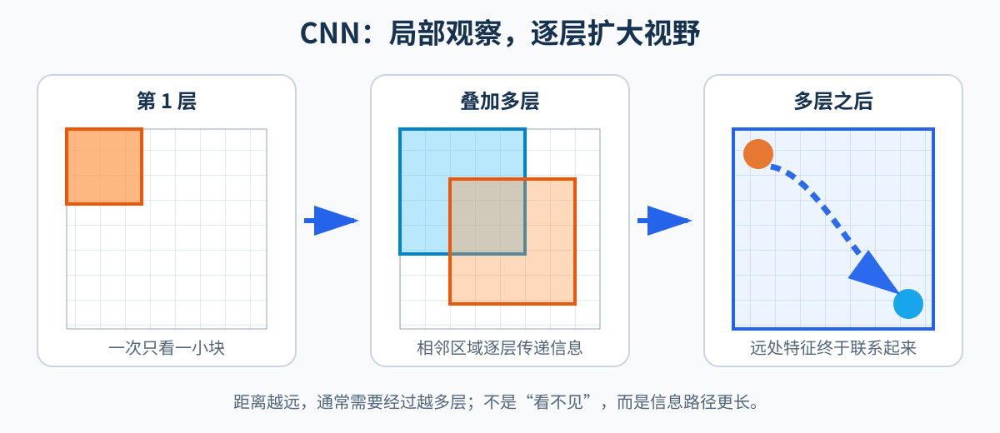
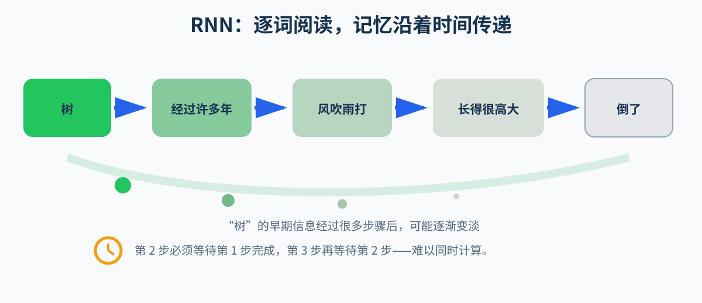

# 为什么 CNN 和 RNN 处理长距离关系比较困难？

在学习 Transformer 之前，可以先理解 CNN 和 RNN 各自是怎样观察数据的。

## 1. CNN：擅长观察局部特征

CNN（卷积神经网络）可以想象成拿着一个很小的放大镜观察图片。



例如，一张图片中有一只猫：

```text
左上角：猫的耳朵
中间：  猫的眼睛
右下角：猫的尾巴
```

一个较小的卷积核每次只能看到图片中的一小块区域：

```text
┌───────────────整张图片───────────────┐
│  ┌──────┐                            │
│  │卷积核│  ← 当前只能观察这一小块      │
│  └──────┘                            │
│                              猫尾巴  │
└──────────────────────────────────────┘
```

因此，CNN 很擅长识别局部特征，例如边缘、纹理、眼睛和耳朵。随着卷积层不断叠加，它的观察范围会逐渐变大，也可以把耳朵、眼睛和尾巴组合成“猫”。

但是，如果两个特征距离很远，信息通常需要经过多层卷积才能联系起来。也就是说，CNN **不是完全不能理解远距离关系**，而是需要依靠更深的网络逐层传递信息。

可以把这个过程想象成传话：

```text
左上角的耳朵 → 中间区域 → 右侧区域 → 右下角的尾巴
```

距离越远，需要经过的中间步骤通常越多。

### 1.1 一个完整的 CNN 卷积示例

下面使用一个具体例子说明卷积层究竟进行了什么计算。假设：

```text
输入矩阵：5×5
卷积核：  3×3
步长：    1
Padding： 0
偏置：    0
```

输入矩阵为：

```text
1   2   3   4   5
6   7   8   9  10
11 12  13  14  15
16 17  18  19  20
21 22  23  24  25
```

卷积核为：

```text
1  0  1
0  1  0
1  0  1
```

卷积核里的 9 个数字是模型参数。它们在一次扫描过程中保持不变，并被重复用于输入矩阵的所有局部区域。

#### 第一步：滑动窗口取出 9 个区域

`3×3` 的卷积核以步长 1 从左向右、从上向下移动。它会观察下面 9 个区域：

```text
区域①          区域②          区域③

1  2  3         2  3  4         3  4  5
6  7  8         7  8  9         8  9 10
11 12 13        12 13 14        13 14 15
```

```text
区域④          区域⑤          区域⑥

6  7  8         7  8  9         8  9 10
11 12 13        12 13 14        13 14 15
16 17 18        17 18 19        18 19 20
```

```text
区域⑦          区域⑧          区域⑨

11 12 13        12 13 14        13 14 15
16 17 18        17 18 19        18 19 20
21 22 23        22 23 24        23 24 25
```

这 9 个 `3×3` 区域是计算时的观察窗口，并不是最终得到的 9 个输出矩阵。

#### 第二步：每个区域计算出一个数字

每个区域都和同一个卷积核对应位置相乘，再把结果相加并加上偏置。这可以看成 `y = ax + b` 在多个输入上的扩展：

```text
y = w₁x₁ + w₂x₂ + ... + w₉x₉ + b
```

例如，区域①与卷积核计算：

```text
输入区域①       卷积核

1   2   3        1  0  1
6   7   8   ×    0  1  0
11 12  13        1  0  1
```

```text
X₁₁ = 1×1 + 2×0 + 3×1
     + 6×0 + 7×1 + 8×0
     + 11×1 + 12×0 + 13×1
     = 35
```

区域②得到：

```text
X₁₂ = 2 + 4 + 8 + 12 + 14 = 40
```

以同样方式计算全部 9 个区域：

```text
区域① → 35    区域② → 40    区域③ → 45
区域④ → 60    区域⑤ → 65    区域⑥ → 70
区域⑦ → 85    区域⑧ → 90    区域⑨ → 95
```

#### 第三步：9 个结果组成一张特征图

把 9 个数字按照窗口原来的位置排列，得到：

```text
35  40  45
60  65  70
85  90  95
```

这张 `3×3` 矩阵叫作第一层的**输出特征图**，它也是第二层的输入。

需要区分：

```text
卷积核中的数字：模型参数，表示这一层要寻找什么特征
卷积产生的数字：中间特征，表示对应区域出现了多少这种特征
```

#### 第四步：第二层继续提取特征

第二层不是停止提取，而是把第一层的特征图当成新输入，再使用第二层自己的卷积核重复相同操作：

```text
原始数据 + 第一层卷积核参数
                ↓
         第一层特征图
                ↓
第一层特征 + 第二层卷积核参数
                ↓
         第二层特征图
```

如果第二层仍使用 `3×3` 卷积核、步长 1 且 `padding=0`，那么 `3×3` 的输入只能被完整覆盖一次，输出大小为 `1×1`。

假设第二层仍使用：

```text
1  0  1
0  1  0
1  0  1
```

那么第二层计算为：

```text
35×1 + 40×0 + 45×1
+ 60×0 + 65×1 + 70×0
+ 85×1 + 90×0 + 95×1
= 325
```

因此：

```text
5×5 原始输入
    ↓ 第一次 3×3 卷积
3×3 第一层特征图
    ↓ 第二次 3×3 卷积
1×1 第二层特征图：325
```

每层卷积后通常还会经过 ReLU 等激活函数。卷积负责线性计算，激活函数引入非线性，使多层网络能够表达复杂规律。

### 1.2 Padding 如何影响输出尺寸

如果不允许卷积核超出输入边界，输出尺寸为：

```text
输出宽度 = 输入宽度 - 卷积核宽度 + 1
```

所以：

```text
5×5 输入 → 3×3 卷积 → 3×3 输出
3×3 输入 → 3×3 卷积 → 1×1 输出
```

如果希望 `3×3` 输入经过卷积后仍得到 `3×3` 输出，可以使用 `padding=1`，先在四周补一圈 0：

```text
0   0   0   0   0
0  35  40  45   0
0  60  65  70   0
0  85  90  95   0
0   0   0   0   0
```

此时 `3×3` 卷积核可以扫描 9 次。使用前面的卷积核，第二层输出为：

```text
100 170 110
190 325 200
150 220 160
```

因此：

```text
padding=0：空间尺寸逐层缩小
padding=1：3×3 卷积、步长 1 时，空间尺寸可以保持不变
```

Padding 影响的是输出特征图的尺寸，不会阻止感受野逐层扩大。

### 1.3 感受野为什么从 1×1 变成 3×3，再变成 5×5

**感受野**表示某一层的一个输出位置，最多依赖原始输入中的多大范围。为避免层数名称混乱，这里把原始输入称为第 0 层：

```text
第0层：原始输入位置       → 感受野 1×1
第1层：第一次 3×3 卷积   → 感受野 3×3
第2层：第二次 3×3 卷积   → 感受野 5×5
第3层：第三次 3×3 卷积   → 感受野 7×7
```

原始输入中的一个数字只代表自己。例如原图中心的 `13` 在卷积之前只包含 `13` 自身的信息，所以起点是 `1×1`。

第一次卷积的左上角输出 `35` 由下面 9 个数字计算得到：

```text
1   2   3        1  0  1
6   7   8   ×    0  1  0
11 12  13        1  0  1

35 = 1 + 3 + 7 + 11 + 13
```

因此，`35` 虽然只是一个数字，但它依赖原图中的 `3×3` 区域，它的感受野是 `3×3`。第一层其余输出也分别依赖一个 `3×3` 区域：

```text
35 来自：        40 来自：        45 来自：

1  2  3          2  3  4          3  4  5
6  7  8          7  8  9          8  9 10
11 12 13         12 13 14         13 14 15
```

只看这三个区域的横向范围：

```text
35 的范围：1 2 3
40 的范围：  2 3 4
45 的范围：    3 4 5
```

它们的并集是原图第 1～5 列：

```text
1 2 3 4 5
```

相邻窗口的步长为 1，因此大量区域重叠。覆盖范围不是 `3+3+3=9`，而是：

```text
第一个窗口贡献 3 格
第二个窗口只新增 1 格
第三个窗口只新增 1 格

3 + 1 + 1 = 5
```

纵向也相同。第一层三行输出的观察区域分别从原图第 1、2、3 行开始，合并后覆盖原图第 1～5 行。

第二层使用同一个示例卷积核处理第一层特征图：

```text
第一层特征图      第二层卷积核

35 40 45          1  0  1
60 65 70     ×    0  1  0
85 90 95          1  0  1
```

计算得到：

```text
第二层输出
= 35×1 + 40×0 + 45×1
+ 60×0 + 65×1 + 70×0
+ 85×1 + 90×0 + 95×1
= 325
```

`325` 直接依赖第一层的 `35、45、65、85、95`。这些数字又分别依赖原图的左上、右上、中心、左下和右下区域。把它们在原图上的范围合并后，覆盖的是完整 `5×5`：

```text
1   2   3   4   5
6   7   8   9  10
11 12  13  14  15
16 17  18  19  20
21 22  23  24  25
```

因此，第二层的 `325` 虽然也只是一个数字，但它间接依赖原始输入的整个 `5×5` 范围，所以它的感受野是 `5×5`。

当卷积核为 `3×3`、步长为 1 时，每增加一层，感受野会向上下左右各扩展 1 格，因此宽和高各增加 2：

```text
1×1 → 3×3 → 5×5 → 7×7 → 9×9
```

在这种条件下，感受野大小可以写成：

```text
新感受野 = 旧感受野 + (卷积核大小 - 1)
```

最容易混淆的是输出尺寸和感受野尺寸：

```text
输出尺寸：这一层一共有多少个输出位置
感受野：  其中一个输出位置依赖原图多大的区域
```

不使用 Padding 时，两者的变化方向可能刚好相反：

```text
特征图尺寸：5×5 → 3×3 → 1×1
感受野尺寸：1×1 → 3×3 → 5×5
```

一句话总结：

> 每层卷积仍然只观察上一层的一小块，但上一层的每个位置已经总结了更早一层的局部信息；相邻区域通过多层卷积逐渐汇合，所以越深层的位置能够间接看到越大的原图范围。

## 2. RNN：按照顺序逐个阅读

RNN（循环神经网络）不像 CNN 那样同时观察一小块空间，它会按照顺序逐个读取文字。



例如：

```text
我 → 不 → 喜欢 → 吃 → 苹果
```

RNN 每读到一个词，都会把当前信息放进自己的“记忆”中，再带着这份记忆读取下一个词：

```text
读到“我”       记忆：句子和“我”有关
读到“不”       记忆：出现了否定
读到“喜欢”     记忆：我不喜欢……
读到“吃”       记忆：我不喜欢吃……
读到“苹果”     记忆：我不喜欢吃苹果
```

所以，RNN 天然知道文字的先后顺序。下面两句话进入 RNN 的顺序不同：

```text
我 → 吃 → 苹果
苹果 → 吃 → 我
```

因此，不能简单地说 RNN 无法区分“我吃苹果”和“苹果吃我”。理论上，RNN 可以利用读取顺序区分它们。

RNN 真正困难的地方是**长距离记忆**。

例如：

```text
我小时候在院子里种下的那棵，经过许多年风吹雨打、如今已经长得非常高大的树，倒了。
```

当 RNN 读到最后的“倒了”时，需要记住很早以前出现的中心词“树”。信息传递过程大致是：

```text
树的信息 → 经过许多年 → 风吹雨打 → 长得很高大 → 倒了
```

中间经过的词越多，早期信息就越可能被后面的信息冲淡。LSTM 和 GRU 改善了这个问题，但仍然需要逐词计算：必须先处理第一个词，才能处理第二个词，再处理第三个词。

## 3. 两者的局限有什么不同？

| 模型 | 怎样处理数据 | 优点 | 主要局限 |
|---|---|---|---|
| CNN | 用卷积核观察局部区域 | 擅长提取局部特征，可以并行计算 | 远距离特征通常需要经过多层才能联系起来 |
| RNN | 按顺序逐个读取 | 天然保留先后顺序 | 长距离信息可能逐渐淡化，而且难以并行计算 |

可以用两句话记住：

> CNN 像拿着小窗口观察，远处的信息需要经过多层才能相遇。
>
> RNN 像从头到尾读文章，知道先后顺序，但读到后面时可能忘记前面的细节。

这正是 Transformer 想要改善的问题：它让每个词可以直接观察其他词，不需要像 RNN 那样把信息逐步传递；同时因为它一次处理所有位置，所以需要额外加入位置编码来告诉模型每个词的先后位置。
